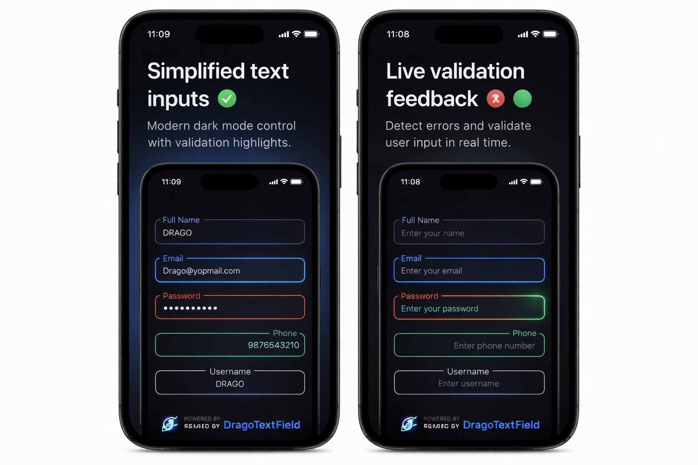

# DragoTextField

A fully customisable `UITextField` wrapper for iOS — supports floating title labels, custom padding, max length, secure entry, and much more. Distributed via Swift Package Manager.

---

## Preview

<p align="center">
  
</p>

---

## Requirements

- iOS 14.0+
- Swift 5.9+
- Xcode 15+

---

## Installation

### Swift Package Manager (SPM)

1. In Xcode, go to **File → Add Package Dependencies**
2. Enter the URL:
   ```
   https://github.com/ThrottleCode/DragoTextField
   ```
3. Select version **1.0.0** or **Up to Next Major**
4. Click **Add Package**

---

## Usage

### Storyboard / XIB

1. Drag a `UIView` onto your storyboard
2. Set its class to `DragotextField` and module to `DragoTextField`
3. Customise properties directly from the **Attributes Inspector**

### Programmatic

```swift
import DragoTextField

let emailField = DragotextField()
emailField.frame = CGRect(x: 20, y: 100, width: 335, height: 55)
emailField.title = "Email"
emailField.PlaceHolder = "Enter your email"
emailField.KeyboardType = .emailAddress
emailField.maxLength = 50
emailField.border_Color = .systemBlue
emailField.cornerRadius = 10
view.addSubview(emailField)
```

### Callbacks

```swift
emailField.onTextEditingChanged = {
    print("Text: \(emailField.text)")
}

emailField.onEditingDidBegin = {
    print("Editing started")
}

emailField.onEditingDidEnd = {
    print("Editing ended")
}

emailField.onReturnKey = {
    emailField.resignFirstResponder()
}
```

### Forwarding UITextFieldDelegate

```swift
emailField.forwardedTextFieldDelegate = self
```

---

## All Properties

### Title Label

| Property | Type | Default | Description |
|---|---|---|---|
| `title` | `String?` | `nil` | Floating label text |
| `titleColor` | `UIColor` | `.black` | Label text colour |
| `titleBGColor` | `UIColor` | `.white` | Label background colour |
| `titleLabelX` | `CGFloat` | `8` | Label origin X |
| `titleLabelY` | `CGFloat` | `0` | Label origin Y |
| `titleFontName` | `String` | `""` | PostScript font name (empty = system font) |
| `titleFontSize` | `CGFloat` | `13` | Label font size |
| `titleAccessibilityIdentifier` | `String` | `""` | Accessibility identifier for the label |

### Border

| Property | Type | Default | Description |
|---|---|---|---|
| `borderWidth` | `CGFloat` | `2` | Text field border width |
| `cornerRadius` | `CGFloat` | `10` | Text field corner radius |
| `border_Color` | `UIColor` | `.black` | Border colour |

### Outer Padding (field frame inside the view)

| Property | Type | Default | Description |
|---|---|---|---|
| `topPadding` | `CGFloat` | `10` | Top spacing for the text field |
| `leftPadding` | `CGFloat` | `2` | Left spacing |
| `rightPadding` | `CGFloat` | `2` | Right spacing |
| `bottomPadding` | `CGFloat` | `2` | Bottom spacing |

### Inner Text Padding (content insets)

| Property | Type | Default | Description |
|---|---|---|---|
| `textFieldPaddingLeft` | `CGFloat` | `10` | Text content left inset |
| `textFieldPaddingRight` | `CGFloat` | `10` | Text content right inset |
| `textFieldPaddingTop` | `CGFloat` | `0` | Text content top inset |
| `textFieldPaddingBottom` | `CGFloat` | `0` | Text content bottom inset |

### Placeholder

| Property | Type | Default | Description |
|---|---|---|---|
| `PlaceHolder` | `String?` | `nil` | Placeholder text |
| `placeholderColor` | `UIColor` | `.placeholderText` | Placeholder colour |
| `placeholderFontName` | `String` | `""` | Placeholder font name |
| `placeholderFontSize` | `CGFloat` | `0` | `0` = matches `textFontSize` |

### Appearance

| Property | Type | Default | Description |
|---|---|---|---|
| `textColor` | `UIColor` | `.black` | Input text colour |
| `textFieldBGColor` | `UIColor` | `.white` | Text field background |
| `textFontName` | `String` | `""` | Input text font name |
| `textFontSize` | `CGFloat` | `16` | Input text font size |

### Keyboard & Input

| Property | Type | Default | Description |
|---|---|---|---|
| `KeyboardType` | `UIKeyboardType` | `.default` | Keyboard type |
| `returnKeyType` | `Int` | `0` | `UIReturnKeyType` raw value |
| `autocapitalizationType` | `Int` | `0` | `UITextAutocapitalizationType` raw value |
| `autocorrectionType` | `Int` | `0` | `UITextAutocorrectionType` raw value |

### Text Field Controls

| Property | Type | Default | Description |
|---|---|---|---|
| `textAlignment` | `Int` | `0` | `NSTextAlignment` raw value |
| `isSecure` | `Bool` | `false` | Secure text entry (password) |
| `clearButtonMode` | `Int` | `0` | `UITextField.ViewMode` raw value |
| `leftViewMode` | `Int` | `0` | Left view mode |
| `rightViewMode` | `Int` | `0` | Right view mode |
| `maxLength` | `Int` | `0` | Max character limit (`0` = unlimited) |
| `textFieldAccessibilityIdentifier` | `String` | `""` | Accessibility identifier |

### Text (convenience)

```swift
// Get
let value = myField.text

// Set
myField.text = "Hello"
```

### First Responder

```swift
myField.becomeFirstResponder()
myField.resignFirstResponder()
```

### Direct TextField Access

```swift
// Access underlying UITextField
myField.textField.leftView = myIconView
myField.textField.rightView = myButtonView
```

---

## License

MIT License — free to use in personal and commercial projects.

---

Created by **Amandeep Singh**
